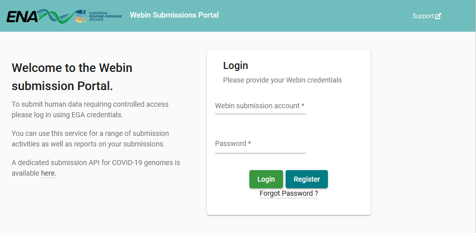
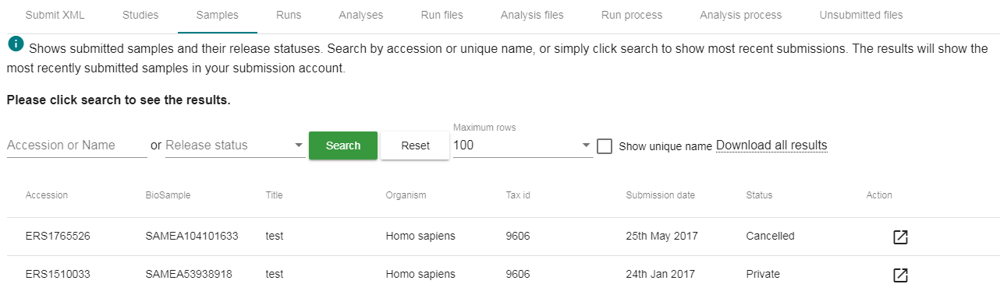
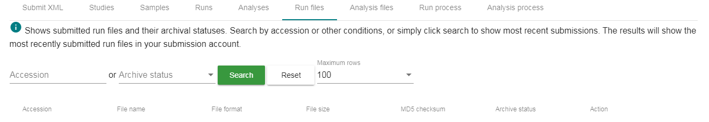
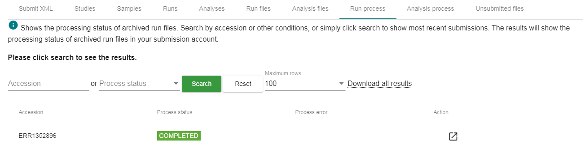
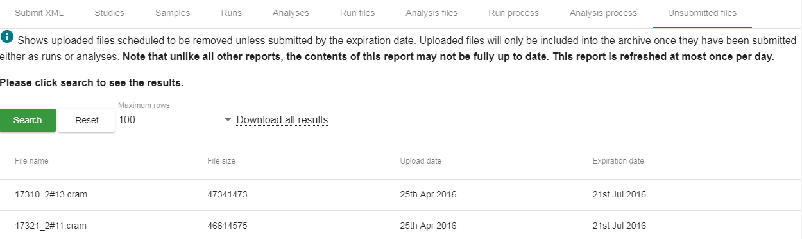

========================
Webin Submissions Portal
========================

.. note::

  The Webin Submissions Portal is currently undergoing a major overhaul and as a result, this page is outdated.
  It will be rewritten soon to explain new functionality and appearance

`Webin Submissions Portal <https://www.ebi.ac.uk/ena/submit/webin>`_ is a simple interactive web interface which supports:

- Submission of XML metadata objects
- Update of XML metadata objects
- Reports from the `Webin Reports Service </reports-service.html>`_
- Download of spreadsheet template for annotated sequences

Service URL
===========

Production service URL:

https://www.ebi.ac.uk/ena/submit/webin/

Test service URL:

https://wwwdev.ebi.ac.uk/ena/submit/webin/

Authentication
==============

Please use your Webin submission account credentials to log in to the service.

Submit XMLs
===========

Once you have logged in you can use the default page to submit XMLs to Webin.

In the example below, one or more studies are being submitted using a project XML (`project.xml`) and a submission XML
(`sub.xml`).
The project XML contains the study details while the submission XML defines the submission actions.

.. image:: ../images/webin_portal_study.png

To submit, simply browse to the `project.xml` and `sub.xml` files and click submit.

You can see the receipt in the browser window either in a tabular format:

.. image:: ../images/webin_portal_study2.png

or you can look at the receipt XML:

.. image:: ../images/webin_portal_study3.png

Reports
=======

Studies
-------

The `Studies` report lists all studies submitted through your
submission account.

.. image:: ../images/webin_portal_studies.png)

The `Release date` shows when the study and any associated data
will be made public. If the `Release date` is in the future
then the `Status` will be `Private`. The status will become `Public`
once the the study release date expires.

In the above example, the status of the study is `Cancelled`. This
means that that study has been withdrawn before making it public.
Studies that are withdrawn after they have become public have
either `Suppressed` or `Killed` status.

Samples
-------

The `Samples` report lists all samples submitted through your submission account.

Like studies all samples have a `Status`.
Note that samples are automatically made public when data referring to them is made public.

Runs
----

The `Runs` report lists all sequence read experiments submitted through your submission account.

.. image:: ../images/webin_portal_runs.png

Sequence read experiments are defined using run and experiment metadata objects.
Data files are associated with runs while experiments link runs to studies and samples.

Run and experiment are automatically made public when the study they are part of is made public.

Analyses
--------

The `Analyses` report lists all analyses submitted through your submission account.

.. image:: ../images/webin_portal_analyses.png

Analyses can be of many different types.
Many analyses are automatically made public when the study they are part of is made public.
Some analyses will always be kept private while their data is made available through other services.

Run Files
---------

The `Run files` report lists all run files submitted through your submission account.

The `Archive status` column value becomes `File archived` once the file has been incorporated into the archive.
Any pre-archival file validation errors are also shown in this column.

Analysis Files
--------------

The `Analysis files` report lists all analysis files submitted through your submission account.

.. image:: ../images/webin_portal_analysis_files.png

The `Archive status` column value becomes `File archived` once the file has been incorporated into the archive.
Any pre-archival file validation errors are also shown in this column.

Run Process
-----------

The `Run process` report lists the processing status of runs submitted through your submission account.

When the `Process status` is `COMPLETED` then the run has been successfully processed by the archive.
Note that submitted files may be archived and available for download without them being succesfully processed.
In this case derived file products, such as archive generated Fastq files, may be missing.

Analysis process
----------------

The `Analysis process` report lists the processing status of analyses submitted through your submission account.

.. image:: ../images/webin_portal_analysis_process.png

When the `Process status` is `COMPLETED` then the analysis has been successfully processed by the archive.
In the above example, the status of the analysis is `CANCELLED`.
This means that that analysis processing has been cancelled and will no longer be attempted.

If any sequence accessions are assigned as part of the analysis processing then they will be listed in the `Sequence
accession` column.

Unsubmitted files
-----------------

Uploading a file to the Webin file upload area is not sufficient for inclusion into the archive.
The file must also be submitted through the Webin submission service either as a run or analysis.

The Webin file upload area is a temporary transit area.
Any unsubmitted files are subject to be removed according to `ENA fair use policy <../fileprep/upload.html>`_.

The unsubmitted file report shows uploaded files scheduled to be removed unless
submitted by the expiration date.

