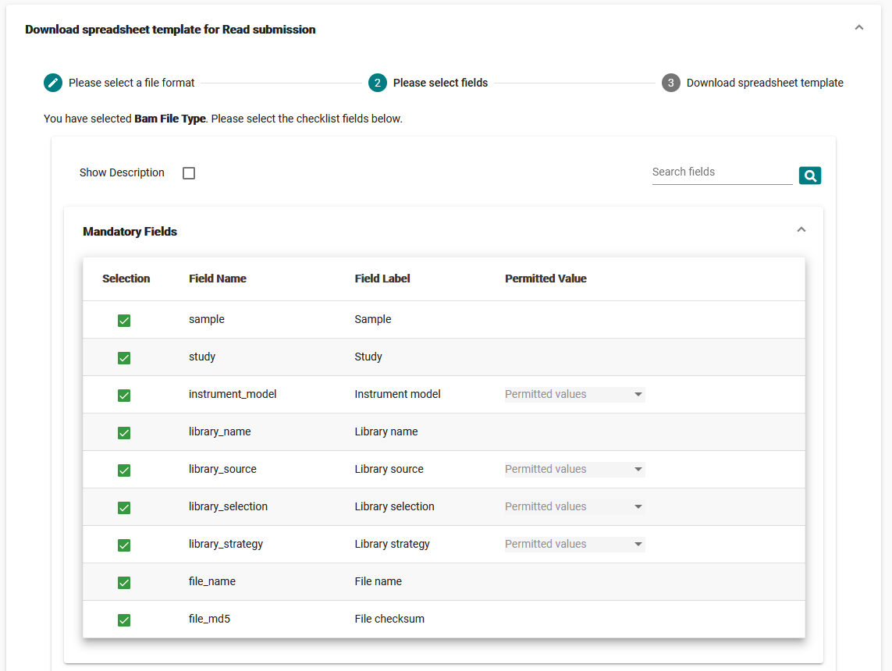

==============================
Submit Raw Reads Interactively
==============================

Read files in ENA are contained by run objects, which point to the location of the file in an FTP directory.
A run is always linked with one experiment object, which describes the library preparation and sequencing protocol.
Experiments are linked with one sample and one study, as shown in the metadata model diagram:

.. image:: ../images/metadata_model_reads.png
   :align: center

Before you register the run and experiment objects through the Webin Submissions Portal (WSP), you should have completed the
following steps:

- `Register a study <../study/interactive.html>`_
- `Register a sample <../samples/interactive.html>`_
- `Upload your read files <../fileprep/upload.html>`_

To start your read submission, log in to the `Webin Submissions Portal <https://www.ebi.ac.uk/ena/submit/webin>`_.
You will need to complete three steps, described below:

1. Select and customise a read submission template spreadsheet
2. Fill out the template spreadsheet
3. Validate and submit the template spreadsheet

If you are unsure, you are welcomed and encouraged to test out your submission through the Webin Submissions Portal
`test version <https://wwwdev.ebi.ac.uk/ena/submit/webin/>`_.
All submissions to the test version are overwritten after 24 hours, so your submissions here are consequence-free.
To be sure that you are in the test environment, always check for the 'wwwdev' URL.

.. _Step 1:

Step 1: Select A Read Spreadsheet
=================================

To begin, log in to the `Webin Submissions Portal <https://www.ebi.ac.uk/ena/submit/webin/login>`_ and select the
'Submit Reads' button.

1. Click the 'Download spreadsheet template for Read submission' option to expand this section
2. Carefully review the list of file formats and choose the one which applies to you.
   Note that there are different options for single and paired FASTQ files.
3. Click the appropriate file format to expand it and see the list of attributes

4. Review the included attributes, their meanings, and requirements.
   Check the boxes next to the non-default attributes to include them.
5. Click 'Next' when you are ready to continue; you can return to this interface later to review attribute meanings and
   requirements
6. Click 'Download TSV Template' to acquire a copy of your customised template spreadsheet

.. _Step 2:

Step 2: Complete The Template Spreadsheet
=========================================

Once you have downloaded the template spreadsheet, you should open it in an appropriate spreadsheet editing program,
such as Microsoft Excel or Google Sheets.
Consider the following tips as you do this:

- Each row of your spreadsheet should describe the files and metadata for exactly one experiment/run pair
- Return to the interface in the previous step to review the meanings of attributes and any requirements they have
- The study and sample fields can be filled out with either SRA or BioStudies/BioSamples accessions
- The file name fields must exactly match the name of a file in your account's upload area
  - If you created subdirectories for your files, include this full path in the file name field
- The MD5 fields should be filled with file MD5 values.
  The MD5 value is a fingerprint value for the file which allows us to verify that it was uploaded successfully.
  In Linux and Mac, you can generate this value from the command line by running the command 'md5' or 'md5sum' on the
  file, while Microsoft has a `support article <https://support.microsoft.com/en-gb/help/889768/how-to-compute-the-md5-or-sha-1-cryptographic-hash-values-for-a-file>`_
  on performing this activity for Windows.
- Do not edit the existing column names
- Use only valid ASCII characters
- When you come to submit the file must use one of the following extensions: .csv, .tsv, .tab, .txt

Once you are satisfied that your spreadsheet content is complete, save the file and move on to the final step.

.. _Step 3:

Step 3: Submit The Template Spreadsheet
=======================================

Return to the 'Submit Reads' interface in `Webin Submissions Portal <https://www.ebi.ac.uk/ena/submit/webin/login>`_.
This time, expand the 'Upload filled spreadsheet template for Read submission' section.

Select the 'Browse' option or click-and-drag the file onto this section.
Then, click the 'Submit Completed Spreadsheet' button to have your file validated and submitted.

.. image:: ../images/wsp_read_2_spreadsheet_submission.png

Should metadata validation fail, you will receive a pop-up with an error message.
If the content of the error message is unclear, please `contact the helpdesk <https://www.ebi.ac.uk/ena/browser/support>`_.

If metadata validation is successful, you will receive a pop-up informing you of this and confirmation of the assigned
experiment and run accessions.
Your files will then be entered into a processing pipeline which will check their validity before moving them to an
archive.
If there are file errors, these will be reported to account holders by the registered email address(es).
You can always check the processing status of your submissions via the run reports available in WSP.

