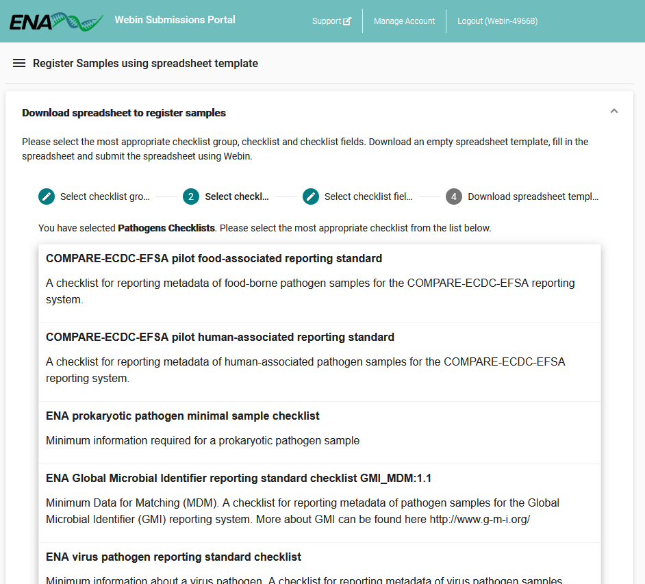
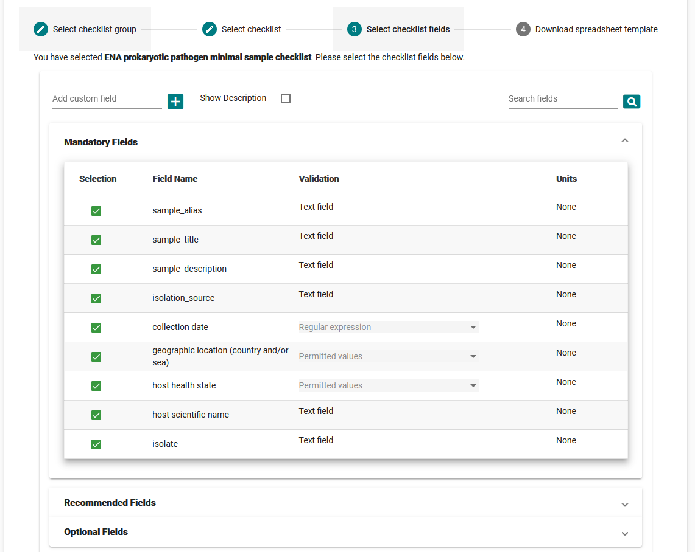
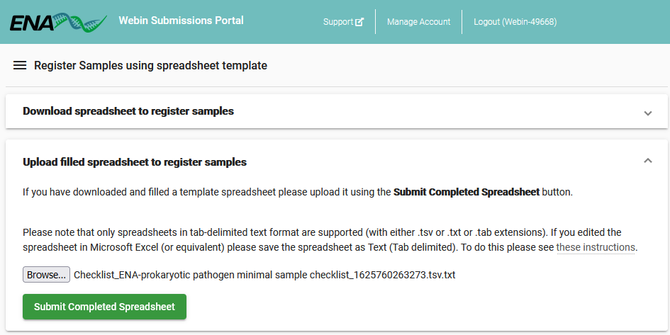

==============================
Register Samples Interactively
==============================

Samples represent the source material that a sequencing library was produced from.
A sample may be connected to reads, assemblies and various types of analysis data.
Samples add context to the data associated with them, making your data more searchable and understandable.

All samples must conform to a checklist of values which depend on the type of sample.
The easiest way to view the available checklists is the `sample checklist portal <https://www.ebi.ac.uk/ena/browser/checklists>`_.

There are three steps to registering your sample(s) through the Webin Submission Portal:

1. Select and customise a sample checklist
2. Fill out a template spreadsheet
3. Validate and submit the template spreadsheet

If you are unsure, you can always try this process out consequence-free using the
Webin Submissions Portal `test version <https://wwwdev.ebi.ac.uk/ena/submit/webin/login>`_.

.. _Step 1:

Step 1: Select A Sample Checklist
=================================

To begin, log in to the `Webin Submissions Portal <https://www.ebi.ac.uk/ena/submit/webin/login>`_ and select the
'Register Samples' button.

1. Click 'Download spreadsheet to register samples' to expand the checklist selection menu

2. You will be presented with groups of checklists: click a checklist group to explore its members, then click the most
   appropriate one

3. Next, you will be presented with lists of checklist attributes, grouped by whether they are mandatory, recommended,
   or optional.
   Expand each to see the range of attributes included in your checklist and their field requirements.
   Optional fields will be deselected by default, while recommended ones will be selected, so review these carefully to
   ensure all appropriate fields are selected.
   Note the 'Add custom field' box to the top-left, which allows you to define additional attributes not included
   in any checklist

4. Finally, click 'Next' and then the 'Download TSV Template' to get a spreadsheet based on your selections so far

.. _Step 2:

Step 2: Complete Template Spreadsheet
=====================================

Once you have downloaded the template spreadsheet, you should open it in an appropriate spreadsheet editing program,
such as Microsoft Excel or Google Sheets.
Consider the following tips as you complete your spreadsheet:

- Use the `sample checklist portal <https://www.ebi.ac.uk/ena/browser/checklists>`_ to look up the requirements and
  restrictions for each field
- Do not edit the first line of the spreadsheet, which specifies the checklist in use
- You can add custom fields by inserting new column headers
- Do not edit the existing column names
- Use only valid ASCII characters
- When you come to submit the file must use one of the following extensions: .csv, .tsv, .tab, .txt

Once you are satisfied with the content of your spreadsheet, be sure to save it then proceed to the next step.

.. _Step 3:

Step 3: Validate And Submit Spreadsheet
=======================================

Return to the 'Register Samples' interface in `Webin Submissions Portal <https://www.ebi.ac.uk/ena/submit/webin/login>`_
and this time expand the 'Upload filled spreadsheet to register samples' option.
Use the 'Browse' button to find the spreadsheet you wish to submit, then click the 'Submit Completed Spreadsheet'
button.

At this point your samples will be validated and if accepted, accession numbers will be reported.
If there are errors with the information you have entered, these will be reported to you.

Note that at this point you have not submitted any data, but you have laid the groundwork for this by providing sample
metadata.