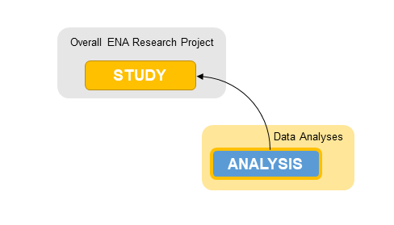

================================
How to Submit Targeted Sequences
================================

Introduction
============

To submit targeted assembled and annotated sequences to ENA you must also 
provide context on the research project where this was assembled.

   
Within ENA, all annotated sequences are submitted as 'analysis' submission 
objects but are processed as 'sequences'.

A sequence submission must be part of an ENA study submission so a study must 
be registered before any sequences are submitted.

Please register a study if you have not done so already:
   
- `Register a study <study.html>`_

.. note::
   This submission route is for a set of stand-alone targeted assembled and annotated sequences only. If you intend to 
   submit an annotated **assembly** such as a genome, please follow the `assembly submission guidelines <assembly.html>`_ 
   and submit your assembly in EMBL flat file format.
   
Accessions
==========

As all sequences in ENA are submitted as 'analyses', for each sequence submission, Webin will report 
a unique accession number that starts with ERZ. This accession number is for internal processing only 
and will not be visible in the browser. As a result, you will recieve additional post-processing accession 
numbers for your sequences via email. 

Always make a note of any accessions you receive as these are the unique identifiers for each of 
your submissions to ENA.

Submission Options
==================

Before you submit an assembled and annotated sequence, you should review the sequence 
checklists available to see if any are suitable for your submission. This checklist will 
simplify and standardise your submission so you can submit with a template spreadsheet. 
The full list of sequence checklists are available `here <https://www.ebi.ac.uk/ena/submit/annotation-checklists>`_.

If there are no suitable checklists available for your submission, then you will need to 
submit your sequences in EMBL flat file format.

Template sequence spreadsheets can be submitted either using Webin Interactive or 
Webin-CLI. You can directly deposit a flat file using Webin-CLI. For an overview of 
the ENA submission interfaces, please see the `General Guide on Submitting to ENA <general-guide.html>`_.

.. toctree::
   :maxdepth: 1

   sequence/interactive
   sequence/webin-cli-flatfile
   sequence/webin-cli-spreadsheet
