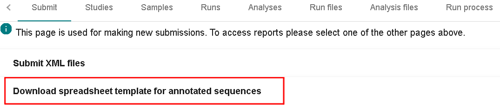
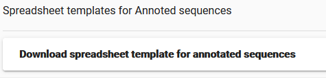
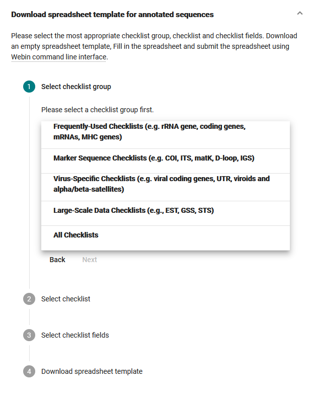
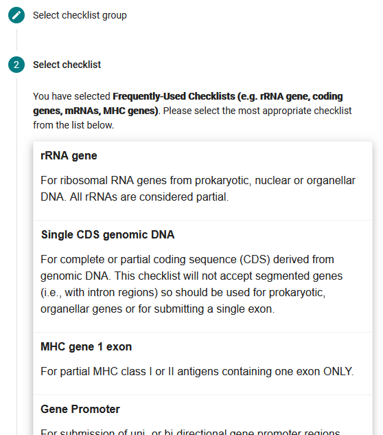
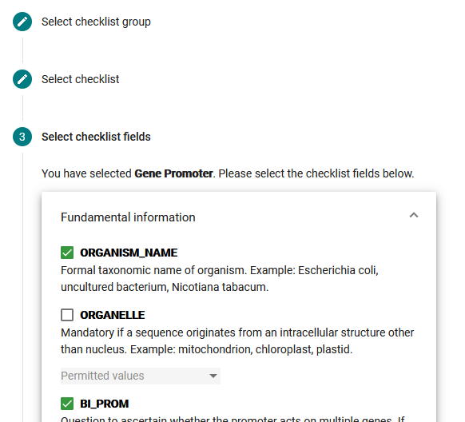
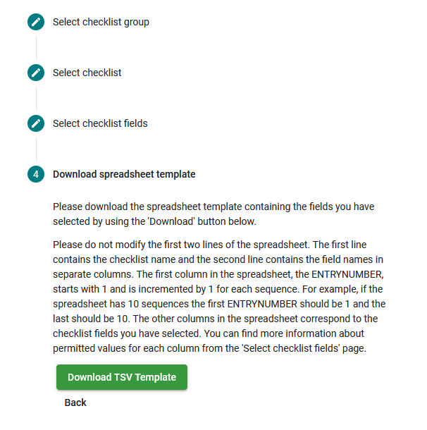

# Submit Annotated Sequence Spreadsheets with Webin-CLI

## Introduction

Annotated sequences (e.g. 16S rRNA genes) can be submitted to the European Nucleotide Archive (ENA)
as tab-separated (tsv) spreadsheets using the [Webin command line submission interface](../general-guide/webin-cli.html)
with `-context sequence` option.

An annotated sequence submission consists of:
- General sequence information
   - Study accession or unique name (alias)
   - Unique name for the submission
   - Free text description of the set of submitted sequences (optional)
- Sequences
- Functional annotation

The following picture illustrates the stages of the annotated sequence spreadsheet submission process:


## Stage 1: Pre-register study

Each submission must be associated with a pre-registered study.

- [Register a Study](../study.html)

## Stage 2: Prepare the files

The set of files that are part of the submission are specified using a manifest file.
The manifest file is specified using the `-manifest <filename>` option.

An annotated sequence spreadsheet submission consists of the following files:

- 1 manifest file
- 1 tab-separated (tsv) spreadsheet containing the sequences and functional annotation

### Manifest file

The manifest file has two columns separated by a tab (or any whitespace characters):
- Field name (first column): case insensitive field name   
- Field value (second column): field value

The following metadata fields are supported in the manifest file:

- STUDY: Study accession or unique name (alias)
- NAME: Unique name for the submission
- DESCRIPTION: Free text description of the set of submitted sequences (optional)

The following file name fields are supported in the manifest file:

- TAB: tab-separated (tsv) spreadsheet containing the sequences and functional annotation

For example, the following manifest file represents a submission:

```
STUDY   TODO
NAME   TODO
TAB    sequences.tsv.gz
```

### Tab-separated (tsv) spreadsheet

Please download and fill a tab-separated (tsv) spreadsheet template
from the [Webin submission portal](../general-guide/submissions-portal.html):

[https://www.ebi.ac.uk/ena/submit/webin](https://www.ebi.ac.uk/ena/submit/webin)

- Step 1: Expand the 'Download spreadsheet template for annotated sequences' option from the 'Submit' page.



- Step 2: Press the 'Start' button.



- Step 3: Select the most appropriate checklist group.



- Step 4: Select the most appropriate checklist.



- Step 5: Select the checklist fields and click 'Next' at the botton of the page.



- Step 6: Click 'Download' button to download the spreadsheet template.




## Stage 3: Validate and submit the files

Files are validated, uploaded and submitted using the [Webin command line submission interface](../general-guide/webin-cli.html).
Please refer to the [Webin command line submission interface](../general-guide/webin-cli.html) documentation for more information
about the submission process.

## Assigned accession numbers

Once the sequences have been submitted an analysis (ERZ) accession number is immediately assigned and
returned to the submitter by the Webin command line submission interface.

The purpose of the ERZ accession number is for the submitter to be able to refer to their submission within the
Webin submission service. For example, the submitter can retrieve the assigned sequence accessions
from the [Webin submissions portal](../general-guide/submissions-portal.html) or from the [Webin reports service](../general-guide/reports-service.html) using
the ERZ accession number.

For sequences, long term stable accession numbers that can be used in publications are:

- Study accession (PRJ) assigned at time of study registration.
- Sequence accession(s) assigned once the submission has been fully processed by ENA.

Submitters can retrieve the sequence accession numbers from the [Webin submissions portal](../general-guide/submissions-portal.html)
or from the [Webin reports service](../general-guide/reports-service.html). These accession numbers are also send to the submitters by
e-mail.

