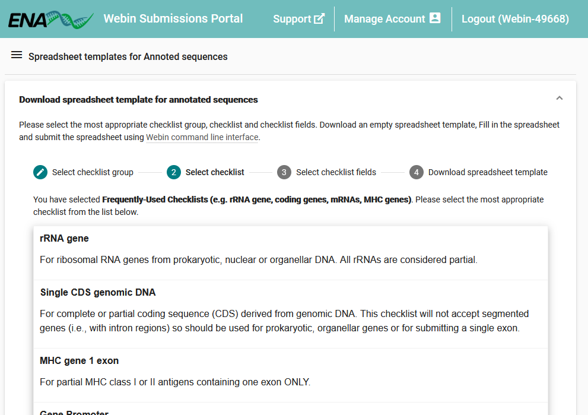

====================================================
Submit Targeted Sequence Spreadsheets with Webin-CLI
====================================================

Introduction
============

Submission of targeted sequences may be done using `Webin-CLI <../general-guide/webin-cli.html>`_ as described in this
page's parent page: `How to Submit Targeted Sequences <../sequence.html>`_.
As described there, you may prepare your submissions in a spreadsheet format in accordance with a checklist, provided
that an appropriate checklist exists.
Please browser the selection of available checklists to determine if this route is correct for you:

- `List of Annotation Checklists <sequence/annotation-checklists.html>`_

If you are satisfied that there is an appropriate checklist, please read on to learn how you may download and complete a
template.
If in doubt, feel free to `contact the helpdesk <https://www.ebi.ac.uk/ena/browser/support>`_.

Step 1: Acquire A Template Spreadsheet
======================================

To begin, log in to the `Webin Submissions Portal <https://www.ebi.ac.uk/ena/submit/webin/login>`_ and select the
'Generate Annotated Sequence Spreadsheet' button.

1. You will be presented with a set of checklist groups: select the appropriate one for your submission, by reference to
   the `List of Annotation Checklists <sequence/annotation-checklists.html>`_ if needed
2. Next, select the actual checklist you intend to use

3. The interface will now present the list of mandatory attributes for your selected checklist

   a. Check the 'Show Description' box for an explanation of each field
   b. Review the 'Validation' column to see what requirements a field may have, e.g. a list of permitted values

4. Ensure you expand the 'Optional Fields' section and review its contents carefully: all these fields are optional,
   because they don't apply in all cases but some may be essential to adequately describe your sequences
5. Check the box next to any optional field you wish to use
6. When you are satisfied with the optional fields you have chosen, click 'Next' or 'Download spreadsheet template' to
   proceed to the final stage of template acquisition
7. On the last page, click the 'Download TSV Template' to get the spreadsheet you have designed

Stage 2: Complete The Template Spreadsheet
==========================================

Once you have downloaded the template spreadsheet, you should open it in an appropriate spreadsheet editing program,
such as Microsoft Excel or Google Sheets.
Consider the following tips as you complete your spreadsheet:

- Each row of the table must include all the metadata and nucleotide sequence of exactly one of your sequence entries
- Refer to the spreadsheet customisation and download interface to check the meaning and requirements of fields
- Ensure that sequence field does not contain any whitespace or newline characters
- Do not modify the first two lines of the spreadsheet
- Do not edit the column names
- The 'Organism' field must match with the scientific name of a species-rank taxon in the NCBI Taxonomy database
  - See `tips for sample taxonomy <../../faq/taxonomy.html>`_ for help with how to identify an appropriate name
- Use only valid ASCII characters in filling out the spreadsheet
- When you come to submit it, the file must use either a '.tsv' or '.tab' format
- Before submitting, you must compress your spreadsheet with GZIP or BZIP2

Once you are satisfied with the content of your file and it has been appropriate compressed, return to the page
`How to Submit Targeted Sequences <../sequence.html>`_ to continue with your submission.

