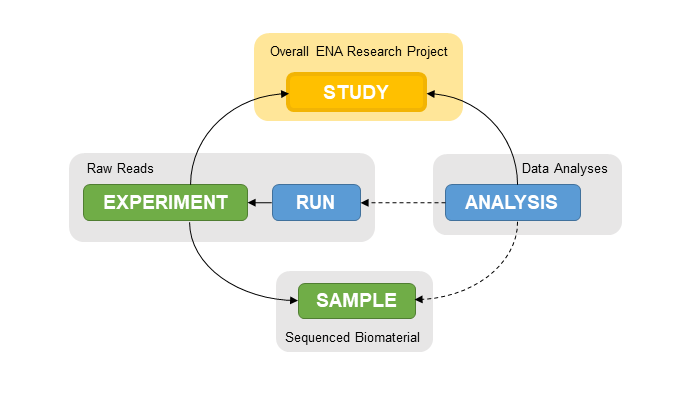

=======================
How to Register a Study
=======================

Introduction
============

Every data submission to ENA requires registration of a study object.

This study is used to group other objects together, so it is the first step 
towards submitting your data to ENA.

The study and its associated data will not become public until the study release 
date has expired. The default for a newly registered study is to have a hold
date two months after the submission date. You can change this date at will 
should you need to release the data or delay its publication further. However,
you will no longer have this option once the data are public. Read more on our
`data release policies FAQ <../../latest/faq/release.html>`_.

Have a look at an `example <https://www.ebi.ac.uk/ena/browser/view/PRJEB1234>`_
of a study in the ENA browser.

Accessions
===========

Once a study is registered, Webin will report two accession numbers for the study. 
The first starts with PRJEB and is called the BioProject accession. This is typically 
used in journal publications. The study will also be assigned an alternative 
accession number that starts with ERP. This accession number is called the 
SRA (Sequence Read Archive) study accession.

Always make a note of any accessions you receive as these are the unique identifiers for each 
of your submissions to ENA.

Submission Options
==================

Studies can be submitted one of two ways, using the Webin Submissions Portal interface or programmatically.
For an overview of these, please see the `General Guide on Submitting to ENA <general-guide.html>`_.

.. toctree::
   :maxdepth: 1

   study/interactive
   study/programmatic
