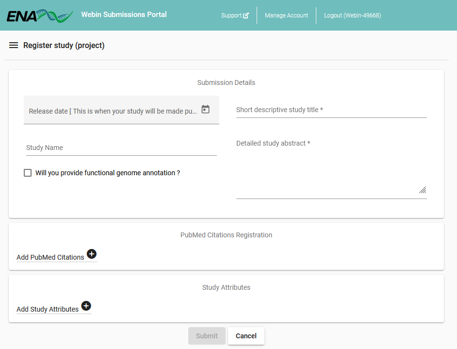

==============================
Register a Study Interactively
==============================

To submit data into ENA you must first register a study to contain and manage it.
Studies (also referred to as projects) can be registered through the
`Webin Submissions Portal <../general-guide/interactive.html>`_.
Log in with your Webin credentials and select the 'Register Study' button to bring up the below interface:

Fill out the form to describe your study: most of these values can be `edited later <../../update/metadata.html>`_
if needed.
This study will eventually be the entry point into your data, so provide a sufficiently detailed abstract that users can
get a good overview of your work.

The release date can be as much as 2 years beyond the present date, and on this day the study and its content will
automatically be made public.
Notification of this will be sent in advance to all email addresses registered with your submission account.
You can change the release date at any time, but once the data becomes public you may not make it private again.
Users are expected to manage the release date of data submitted to ENA, but may write to the
`helpdesk <https://www.ebi.ac.uk/ena/browser/support>`_ to request that it be temporarily suppressed.

Once registration is complete, you will be assigned accession numbers.
You may return to the dashboard and select the 'Studies Report' button to review registered studies.

Locus Tag Prefixes
==================

If you intend to submit a genome assembly which includes functional annotation, you will need to register a locus tag
prefix.
To do this, first check the box asking 'Will you provide functional genome annotation?'

An additional field will appear at the bottom of the page allowing you to add one or more locus tag prefixes.
All prefixes you enter must conform to the following rules:
 - Starts with a letter
 - Between 3 and 12 characters long
 - Is upper case
 - Contains only alpha-numeric characters and no symbols such as -_*

Note that the prefixes will only be validated when you click the 'Submit' button.
Once you complete registration of a locus tag prefix, it will take 24 hours for the prefix to be usable.