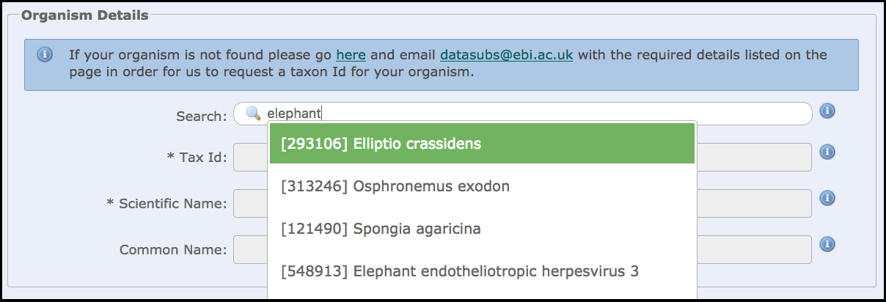

# Taxonomic classifications for your samples

## The Tax database

Every ENA sample object should have a taxonomic classification. The INSDC maintains a database of all unique taxonomy classifications known to us and you should apply one from this database when you create your samples. Each classification has a unique id and this is expanded to show the scientific name and common name of the organism when the sample is viewed.

The [interactive submission service](https://www.ebi.ac.uk/ena/submit/sra/#home) has a look up table which you can use before you download the spreadsheet template so that you already know what taxonomy identifications to apply when you are creating your samples offline.



## REST access to the tax database

Submitters using the REST API to programmatically submit samples in XML format can use the taxonomy database look up to find what tad id they need to apply to their sample using these REST endpoints:

1. If you know the scientific name of the organism you can find the taxonomy id with this endpoint `www.ebi.ac.uk/ena/data/taxonomy/v1/taxon/scientific-name/`. Simply append the scientific name to the URL. You can use a browser or use cURL at the command line (the "see URL" program available on Linux and Mac). 

```bash
> curl "http://www.ebi.ac.uk/ena/data/taxonomy/v1/taxon/scientific-name/Leptonycteris%20nivalis"
[
  {
    "taxId": "59456",
    "scientificName": "Leptonycteris nivalis",
    "commonName": "Mexican long-nosed bat",
    "formalName": "true",
    "rank": "species",
    "division": "MAM",
    "lineage": "Eukaryota; Metazoa; Chordata; Craniata; Vertebrata; Euteleostomi; Mammalia; Eutheria; Laurasiatheria; Chiroptera; Microchiroptera; Phyllostomidae; Glossophaginae; Leptonycteris; ",
    "geneticCode": "1",
    "mitochondrialGeneticCode": "2",
    "submittable": "true"
  }
]
```

2. You can do the same with the common name. Use endpoint `http://www.ebi.ac.uk/ena/data/taxonomy/v1/taxon/any-name/` and append the name

```bash
> curl "http://www.ebi.ac.uk/ena/data/taxonomy/v1/taxon/any-name/golden%20arrow%20poison%20frog"
[
  {
    "taxId": "377316",
    "scientificName": "Atelopus zeteki",
    "commonName": "golden arrow poison frog",
    "formalName": "true",
    "rank": "species",
    "division": "VRT",
    "lineage": "Eukaryota; Metazoa; Chordata; Craniata; Vertebrata; Euteleostomi; Amphibia; Batrachia; Anura; Neobatrachia; Hyloidea; Bufonidae; Atelopus; ",
    "geneticCode": "1",
    "mitochondrialGeneticCode": "2",
    "submittable": "true"
  }
]
```

3. If you do not know the scientific name or the common name but you have an idea, you can use this *suggest* endpoint `http://www.ebi.ac.uk/ena/data/taxonomy/v1/taxon/suggest-for-submission/`

```bash
> curl "http://www.ebi.ac.uk/ena/data/taxonomy/v1/taxon/suggest-for-submission/curry"
[
  {
    "taxId": "159030",
    "scientificName": "Murraya koenigii",
    "displayName": "curry leaf"
  },
  {
    "taxId": "261786",
    "scientificName": "Helichrysum italicum",
    "displayName": "curry plant"
  }
]
```

In each case above a JSON document is outputted and you will be looking for the *taxId* field. Use of the JSON format will help you to automate the call if appropriate.
