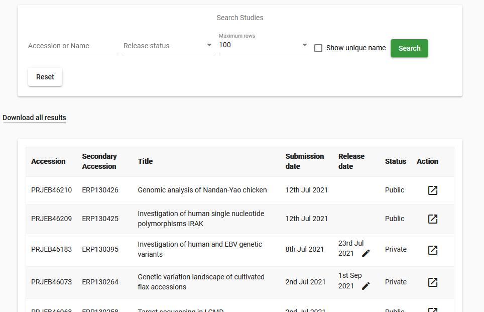
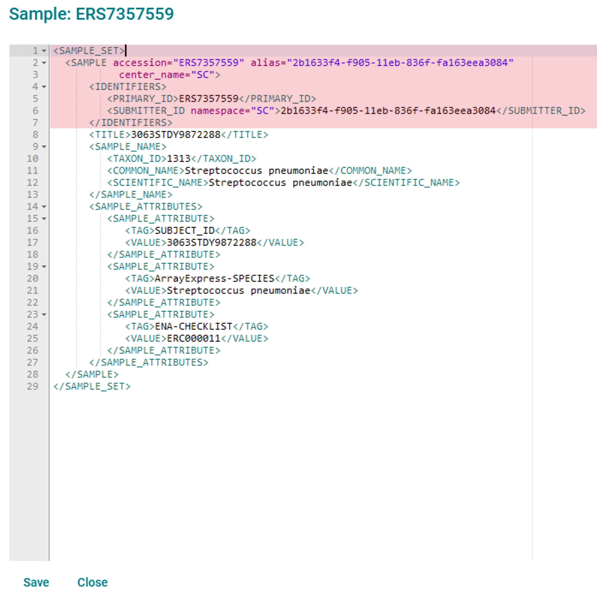
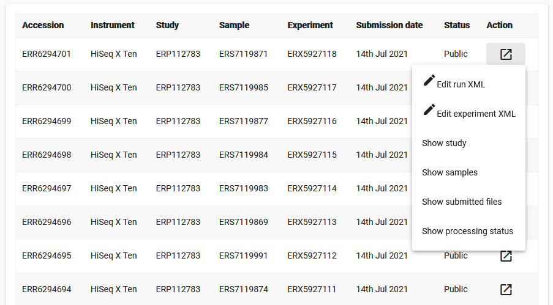
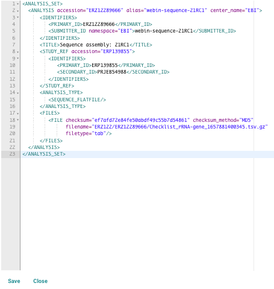

=============================================================
Updating Studies, Samples, Experiments, Runs and Analyses Interactively
=============================================================

The `Webin Portal <https://www.ebi.ac.uk/ena/submit/webin/>`_ allows you to edit some of your
submitted objects.
Access these existing objects by clicking the relevant tab after logging in to
`Webin <https://www.ebi.ac.uk/ena/submit/sra/#home>`_.

Note that under no circumstances can an object's own accession or alias attribute be edited.
The names of submitted files are also not editable, though the associated MD5 value can be updated.

When editing the XML version of an object, you should in general leave the element tags unchanged.
These are the capitalised words enclosed in '<>'.
For example, in the below XML snippet you should leave the words 'ELEMENT' unchanged and edit the 'value'.

::

    <ELEMENT>value</ELEMENT>

For samples, there may sometimes be good reason to add, remove, or edit the element names.

- 1: `Study Edits`_
- 2: `Sample Edits`_
- 3: `Experiment And Run Edits`_
- 4: `Analysis Edits`

Study Edits
===========

Some parts of the study object can be edited.
These include the release date, title, description and publication references.

1. Log in to `Webin Portal <https://www.ebi.ac.uk/ena/submit/webin/login>`_ and select the 'Studies Report' button to be
   presented with the below interface:

2. Find the study you wish to edit in the list, or search for it by accession/name
3. If your study is private, you can change the release date by clicking the pencil icon and navigating to the
   required date in the calendar. Read more on this in our `Data Release Policies FAQ <../../faq/release.html>`_
4. For edits other than changing the release date, click the Action button and then the 'Edit study (project)' option
   for a graphical interface or the 'Edit study (project) XML' option to work in XML format

.. image:: ../images/wsp_meta_update_02_study_edit_interface.png

5. Edit values in this interface as required: the short name for the study will be visible in search outputs and
   overview pages whereas the descriptive title and abstract will be presented in the study's public page
6. If you now wish to add a genome assembly with functional annotation to this study, start by checking the box for this
   and then registering a `locus tag prefix <../..faq/locus_tags.html>`_ at the bottom of the page
7. You can add papers by searching the PubMed ID; through integration with ePMC these papers will then be linked from
   this study's page in the ENA Browser
8. Add additional keywords as desired; for example you may add a DOI as shown above
9. Save your changes when you are satisfied, or click 'Cancel' to abandon them

Sample Edits
============

1. Log in to `Webin Portal <https://www.ebi.ac.uk/ena/submit/webin/login>`_ and select the 'Samples Report' button to be
   presented with a list of your registered samples:
2. To edit a sample, click its 'Action' button and select 'Edit sample XML'
3. Your sample will be shown as an XML document which you can edit directly:

4. Do not edit the attributes highlighted in red (accession, alias, and centre name details) as you will not be able to
   save these changes
5. Make changes as required and click the 'Save' button; your changes will not be saved if they invalidate the file
6. Changing the checklist attribute is allowed, but your sample must conform to the requirements of the new checklist
7. Add new '<SAMPLE_ATTRIBUTE>' blocks are desired

Note that not all fields can be edited: the sample alias and accession are immutable, and you will not be allowed to
remove an attribute which is required by the specified checklist.

Experiment And Run Edits
========================

In `Webin Portal <https://www.ebi.ac.uk/ena/submit/webin/login>`_ experiments and runs are both listed in the 'Runs Report' page,
where matched pairs of experiments and runs share a row in the table.
Note that their are separate 'Edit' buttons for the two object types:

Be sure to use the correct edit button for the object you wish to edit (see common examples of each below).
When you click the edit button, you will be shown the relevant object in XML format.
Locate the element you wish to change and make the required changes, then click 'Save'.
You will not be able to save changes which invalidate the file.

Common Experiment Updates
-------------------------

The experiment object provides important metadata about how your data was produced.
Common updates might include:

- Changing the library descriptor where a mistake has been made e.g. the library source could be
  listed as 'GENOMIC' when in fact it is 'METAGENOMIC'
- Changing the <SAMPLE_DESCRIPTOR> where the experiment is pointing at the wrong sample
- Changing the <STUDY_REF> where the experiment is pointing at the wrong study
- Adding new <EXPERIMENT_ATTRIBUTE> elements to provide additional information about your experiment

All of the above can be achieved by editing the XML displayed when you click the 'Edit' button.

Common Run Updates
------------------

The most common run edit would be an MD5 update.
You may need to do this if:

- An incorrect MD5 value has been registered for a file
- An invalid file has been replaced with a valid one, which has a different MD5 value

Find the <FILE> element's 'checksum' attribute and correct the 32-digit value.

It is not possible to replace the uploaded file in this way; entering a new filename will not be accepted.
If the submitted file has passed validation and been archived, it cannot be replaced.
If the submitted file has failed validation, it must be replaced with an identically-named, corrected file.

Analysis Edits
============

1. Log in to `Webin Portal <https://www.ebi.ac.uk/ena/submit/webin/login>`_ and select the 'Analyses Report' button to be
   presented with a list of analysis accessions generated for your assembly or sequence submissions
2. To edit an analysis, click its 'Action' button and select 'Edit analysis XML'
3. Your analysis will be shown as an XML document which you can edit directly:

4. Do not edit the attributes displayed in blue (accession, alias, centre name, checksum, checksum method, file name and file type  details) as you will not be able to
   save these changes
5. Make changes as required and click the 'Save' button; your changes will not be saved if they invalidate the file
6. Click on 'Cancel' if you would like to abandon your changes
7. The most common analysis edit would be to change the <PRIMARY_ID> and <SECONDARY_ID> where the analysis is pointing at the wrong study
